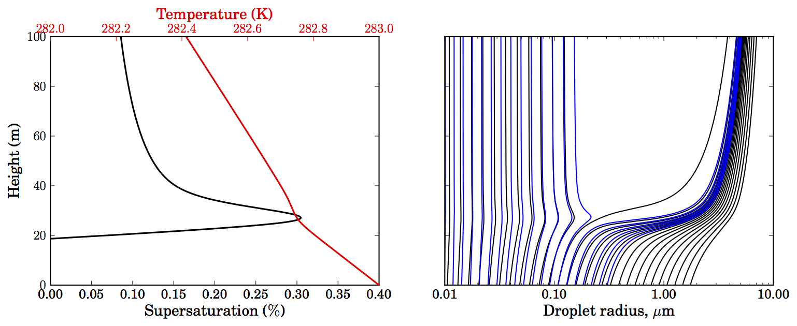

pyrcel: cloud parcel model
==========================

This is an implementation of a simple, adiabatic cloud parcel model for use in
aerosol-cloud interaction studies. [Rothenberg and Wang (2016)](http://journals.ametsoc.org/doi/full/10.1175/JAS-D-15-0223.1) discuss the model in detail and its improvements
 and changes over [Nenes et al (2001)][nenes2001]:

* Implementation of κ-Köhler theory for condensation physics ([Petters and
Kreidenweis, 2007)][pk2007]
* Extension of model to handle arbitrary sectional representations of aerosol
populations, based on user-controlled empirical or parameterized size distributions
* Improved, modular numerical framework for integrating the model, including bindings
to several different stiff integrators:
    - `lsoda` - [scipy ODEINT wrapper](http://docs.scipy
    .org/doc/scipy/reference/generated/scipy.integrate.odeint.html)
    - `vode, lsode*, lsoda*` - ODEPACK via [odespy][hplgit]
    - `cvode` - SUNDIALS via [Assimulo](http://www.jmodelica.org/assimulo_home/index
    .html#)

among other details. It also includes a library of droplet activation routines and scripts/notebooks for evaluating those schemes against equivalent calculations done with the parcel model.

Updated code can be found the project [github repository](https://github.com/darothen/pyrcel). If you'd like to use this code or have any questions about it, please [contact the author][author_email]. In particular, if you use this code for research purposes, be sure to carefully read through the model and ensure that you have tweaked/configured it for your purposes (i.e., modifying the accomodation coefficient); other derived quantities).

[Detailed documentation is available](http://pyrcel.readthedocs.org/en/latest/index.html), including a [scientific description](http://pyrcel.readthedocs.org/en/latest/sci_descr.html), [installation details](http://pyrcel.readthedocs.org/en/latest/install.html), and a [basic example](http://pyrcel.readthedocs.org/en/latest/examples/basic_run.html) which produces a figure like the plot at the top of this page.

Requirements
------------

**Required**

* Python
    + Python 3 is strongly encouraged; Python 2.7 is supported via [future]
    (http://python-future.org/). Python 2.6 is **not** supported!
* [NumPy](http://www.numpy.org)
* [SciPy](http://www.scipy.org)
* [pandas](http://pandas.pydata.org) - v0.17+
* [xarray](http://xarray.pydata.org/en/stable/) - v0.7+
* [PyYAML](http://pyyaml.org/)

**Optional**

The following packages are used for better numerics (ODE solving)

* [odespy](http://hplgit.github.io/odespy/doc/web/index.html) (*Python 2.7 only*)
* [Assimulo](http://www.jmodelica.org/assimulo)

The easiest way to satisfy the basic requirements for building and running the
model is to use the [Anaconda](http://continuum.io/downloads) scientific Python
distribution. Alternatively, a
[miniconda environment](http://conda.pydata.org/docs/using/envs.html) is
provided to quickly set-up and get running the model. Assimulo's dependency on
the SUNDIALS library makes it a little bit tougher to install in an automated
fashion, so it has not been included in the automatic setup provided here; you
should refer to [Assimulo's documentation](http://www.jmodelica.org/assimulo_home/installation.html)
for more information on its installation process. Note that many components of
the model and package can be used without Assimulo.

Development
-----------

[http://github.com/darothen/pyrcel]()

Please fork this repository if you intend to develop the model further so that the
code's provenance can be maintained.

License
-------

[All scientific code should be licensed](http://www.astrobetter.com/the-whys-and-hows-of-licensing-scientific-code/). This code is released under the New BSD (3-clause) [license](LICENSE.md).

[author_email]: mailto:darothen@mit.edu
[nenes2001]: http://nenes.eas.gatech.edu/Preprints/KinLimitations_TellusPP.pdf
[pk2007]: http://www.atmos-chem-phys.net/7/1961/2007/acp-7-1961-2007.html
[hplgit]: https://github.com/hplgit/odespy